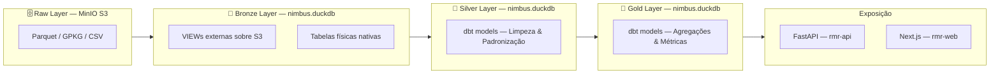

# Arquitetura de Dados — Projeto Nimbus

> **Projeto:** Nimbus — Sistema de Alertas Climáticos da Região Metropolitana do Recife (RMR)  
> **Versão da Arquitetura:** 1.0 — On-Premise / Local
> **Última Atualização:** 16/08/2026 

---

## 1. Contexto & Objetivo

O projeto **Nimbus** tem como objetivo a construção de uma plataforma de monitoramento e alertas climáticos voltada para a Região Metropolitana do Recife (RMR) e, futuramente, outros estados. A plataforma integra dados meteorológicos em tempo real, séries históricas de chuva, dados oceanográficos, informações demográficas e informações enviadas por usuários para suportar alertas preventivos e tomada de decisão.

A arquitetura foi desenhada para:
1. Funcionar 100% **on-premise** em ambiente local de desenvolvimento.
2. Permitir **migração incremental para nuvem** com mínima reescrita de código.
3. Garantir **abertura e portabilidade**, foram priorizadas ferramentas open-source com equivalentes gerenciados na nuvem.

---

## 2. Arquitetura Medallion 

O projeto adota o padrão **Medallion Architecture**, organizando os dados em três camadas progressivas de qualidade:



| Camada | Propósito | Tecnologia Atual |
| :--- | :--- | :--- |
| **Raw** | Armazenamento bruto dos dados como recebidos das fontes | MinIO (S3-compatible) |
| **Bronze** | Leitura tipada e versionada dos arquivos raw. Dados sem transformação | DuckDB (`nimbus.duckdb`) |
| **Silver** | Limpeza, padronização de tipos, deduplicação e enriquecimento | dbt Core + DuckDB |
| **Gold** | Agregações, métricas de negócio e datasets analíticos prontos para consumo | dbt Core + DuckDB |

---

## 3. Stack de Ferramentas (Ambiente Local)

### 3.1 Object Storage — MinIO

| | |
|---|---|
| **Descrição** | MinIO é um sistema de armazenamento de objetos open-source compatível com a API do Amazon S3. Rodando em container Docker, ele atua como o Data Lake local do projeto. |
| **Uso no Projeto** | Armazenamento dos arquivos Parquet produzidos pelos scripts de extração, organizados em buckets por fonte de dado. |
| **Justificativa** | Compatibilidade direta com a API S3 da AWS e com o Google Cloud Storage (GCS). O código de escrita/leitura (`boto3`, `s3fs`, `pyarrow`) é 100% reutilizável na nuvem, bastando trocar o endpoint. |
| **Equivalente em Nuvem** | Google Cloud Storage (GCS) / MagaluCloud Object Storage |
| **Interface Admin** | `http://localhost:9001` |
| **Endpoint API** | `http://localhost:9000` |

### 3.2 Banco de Dados Analítico — DuckDB

| | |
|---|---|
| **Descrição** | DuckDB é um banco de dados OLAP embarcado e de alta performance, projetado para queries analíticas sobre dados locais e remotos (S3, Parquet, CSV, GPKG). |
| **Uso no Projeto** | Motor analítico central do projeto. Hospeda o schema `bronze` (VIEWs sobre MinIO S3 e tabelas físicas nativas), e futuramente os schemas `silver` e `gold` (via dbt). |
| **Justificativa** | Zero infraestrutura — roda como arquivo local (`nimbus.duckdb`). Leitura nativa de Parquet sobre S3 via extensão `httpfs`. Performance columnar sem necessidade de servidor. |
| **Equivalente em Nuvem** | BigQuery (GCP) — mesmo paradigma OLAP serverless; os modelos dbt são portáveis. |
| **Arquivo** | `include/data/nimbus.duckdb` |

### 3.3 Transformação de Dados — dbt Core

|                          |                                                                                                                          |
| ------------------------ | ------------------------------------------------------------------------------------------------------------------------ |
| **Descrição**            | dbt (Data Build Tool) é o padrão de mercado para transformação de dados em SQL com versionamento, testes e documentação. |
| **Uso no Projeto**       | Responsável pelas camadas Silver e Gold, transformações, testes de qualidade e documentação do lineage de dados.         |
| **Justificativa**        | Código SQL portável. Os modelos dbt escritos para DuckDB são migráveis para BigQuery com mínimas alterações de sintaxe.  |
| **Equivalente em Nuvem** | dbt Core (self-hosted) ou dbt Cloud, apontando para BigQuery.                                                            |
| **Diretório**            | `transform/`                                                                                                             |

### 3.4 Orquestração — Prefect *(Em implementação)*

|                          |                                                                                                                                                     |
| ------------------------ | --------------------------------------------------------------------------------------------------------------------------------------------------- |
| **Descrição**            | Prefect é uma plataforma moderna de orquestração de workflows Python, com foco em observabilidade e simplicidade.                                   |
| **Uso no Projeto**       | Substituirá os DAGs do Airflow para agendar e monitorar a execução dos scripts de extração e transformação.                                         |
| **Justificativa**        | API Pythônica, fácil deployment local (Prefect Server) e suporte nativo a execução em nuvem (Prefect Cloud) sem necessidade de reescrita dos flows. |
| **Equivalente em Nuvem** | Prefect Cloud (gerenciado), mantendo os mesmos flows Python.                                                                                        |
| **Status**               | Planejado — substituindo Airflow (dags/ ainda presente no repositório).                                                                             |

### 3.5 Extração de Dados — Python (scripts modulares)

|                            |                                                                                                               |
| -------------------------- | ------------------------------------------------------------------------------------------------------------- |
| **Descrição**              | Scripts Python independentes, um por fonte de dado, localizados em `include/pipeline/extract/`.               |
| **Uso no Projeto**         | Responsáveis por consumir APIs externas, estruturar os dados em DataFrames e persistir em Parquet no MinIO.   |
| **Bibliotecas Principais** | `requests`, `pandas`, `pyarrow`, `s3fs`, `selenium` (para scraping APAC)                                      |
| **Justificativa**          | Modularidade — cada script pode ser executado/testado independentemente ou encapsulado como uma Prefect Task. |

---

## 4. Arquitetura de Migração para Nuvem

A migração é planejada de forma **incremental e híbrida** entre **GCP** e **MagaluCloud**, aproveitando a compatibilidade S3 e a portabilidade dos modelos dbt.
### 4.1 GCP — Responsabilidades

| Serviço GCP                    | Equivalente Local        | Finalidade                                                 |
| :----------------------------- | :----------------------- | :--------------------------------------------------------- |
| **Google Cloud Storage (GCS)** | MinIO                    | Data Lake — armazenamento dos arquivos Parquet (Raw Layer) |
| **BigQuery**                   | DuckDB (`nimbus.duckdb`) | Data Warehouse — Bronze, Silver e Gold via dbt             |
### 4.2 MagaluCloud — Responsabilidades

| Serviço | Finalidade |
| :--- | :--- |
| **VM Dedicada** | Hospedagem do **Prefect Server** — orquestração dos flows de extração, transformação e carga. Templates e demais serviços a serem definidos (TBD). |

> **Justificativa de Uso da MagaluCloud:** Alternativa de nuvem nacional (soberania de dados, conformidade com LGPD, potencial menor custo operacional) para componentes de orquestração que não precisam da escala do GCP.

---

## 5. Estrutura do Repositório

```
rmr-alertas/
├── dags/                    # DAGs do Airflow (legado — será migrado para Prefect)
├── docs/                    # Documentação técnica do projeto
├── include/
│   ├── config/
│   │   └── settings.py      # Configurações centralizadas e carregamento do .env
│   ├── data/
│   │   └── nimbus.duckdb    # Banco DuckDB analítico
│   └── pipeline/
│       ├── extract/         # Scripts de extração por fonte
│       └── storage/
│           ├── setup_minio.py    # Provisionador de buckets
│           └── duckdb_minio.py   # Gerenciador de conexão DuckDB + MinIO
├── rmr-api/                 # Backend FastAPI
├── rmr-web/                 # Frontend Next.js
├── transform/               # Modelos dbt (Silver e Gold)
├── docker-compose.override.yml  # Infraestrutura local (MinIO)
└── .env                     # Credenciais (não versionado)
```

